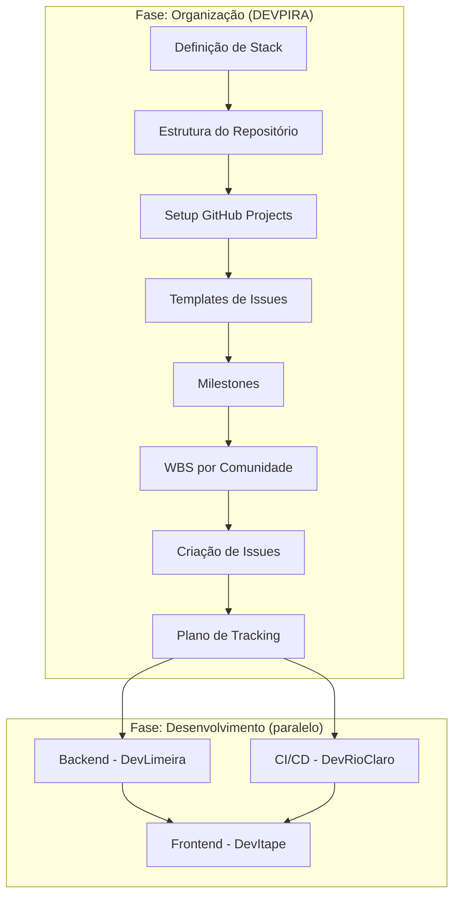
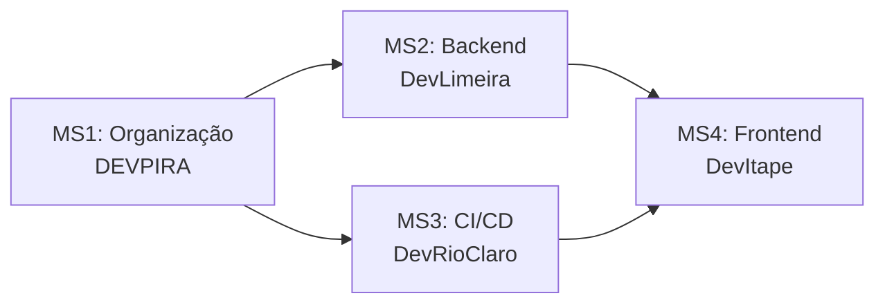

# Design Document: Agenda Tech — Definição e Organização do Projeto

## Overview

Este documento de design detalha a arquitetura organizacional e as decisões técnicas para a fase de definição e especificação do projeto **Agenda Tech**. O escopo cobre exclusivamente a estruturação do repositório, configuração de ferramentas de gestão (GitHub Projects), templates, milestones, breakdown de tarefas por comunidade e plano de acompanhamento.

O Agenda Tech é um calendário colaborativo open-source para comunidades de tecnologia registrarem eventos. O projeto é construído ao vivo durante o "Communities WKND Boituva" com contribuições de 4 comunidades, cada uma responsável por uma camada:

- **DEVPIRA** — Organização, gestão e project management
- **DevLimeira** — Backend (APIs)
- **DevRioClaro** — CI/CD e testes
- **DevItape** — Frontend

**Decisão-chave:** Esta fase não produz código de aplicação. Todos os entregáveis são artefatos de documentação, configuração de repositório e setup de ferramentas de gestão do GitHub.

## Architecture

A "arquitetura" desta fase é organizacional, não de software. Ela define como os artefatos de projeto se relacionam e qual a ordem de execução.



### Fluxo de Dependências entre Milestones



### Decisões Arquiteturais

| Decisão | Escolha | Justificativa |
|---------|---------|---------------|
| Ferramenta de gestão | GitHub Projects (built-in) | Integração nativa com issues, PRs e automações do repositório |
| Metodologia | Kanban (quadro com 4 colunas) | Visualização simples de fluxo para evento ao vivo |
| Organização de labels | Por comunidade + por camada | Permite filtros cruzados (quem faz + o que faz) |
| Estimativa | Story points (1, 2, 3, 5, 8) | Escala Fibonacci simplificada, familiar para equipes ágeis |
| Prioridade | Alta / Média / Baixa | Simplicidade para contexto de evento |
| Convenção de commits | Conventional Commits | Padrão amplamente adotado, facilita changelog automático |
| Branch strategy | GitHub Flow (feature branches → main) | Simples, adequado para projeto open-source com PRs |

## Components and Interfaces

### Componente 1: Estrutura do Repositório

```
AgendaTech/
├── .github/
│   ├── ISSUE_TEMPLATE/
│   │   ├── feature.yml
│   │   ├── bug.yml
│   │   └── infra.yml
│   ├── PULL_REQUEST_TEMPLATE.md
│   └── workflows/           # (DevRioClaro configura)
├── docs/
│   ├── stack.md             # Definição de stack
│   ├── wbs.md               # Work Breakdown Structure
│   ├── escopo-funcional.md  # Especificação funcional
│   ├── tracking-plan.md     # Plano de tracking
│   └── wireframes/          # Wireframes de baixa fidelidade
├── backend/                  # (DevLimeira desenvolve)
├── frontend/                 # (DevItape desenvolve)
├── infra/                    # Configs de CI/CD (DevRioClaro)
├── CONTRIBUTING.md
├── LICENSE                   # MIT
└── README.md
```

### Componente 2: GitHub Projects — Board Configuration

**Colunas do Quadro (ordem esquerda → direita):**

| Coluna | Descrição | Trigger de Entrada |
|--------|-----------|-------------------|
| To Do | Tarefas planejadas, não iniciadas | Issue criada com label de comunidade |
| In Progress | Trabalho em andamento | Assignee inicia trabalho |
| Review | PR aberto aguardando revisão | PR vinculado à issue é aberto |
| Done | Tarefa concluída | PR aprovado e mergeado |

**Labels de Comunidade:**
- `devpira` — Organização e gestão
- `devlimeira` — Backend
- `devrioclaro` — CI/CD e testes
- `devitape` — Frontend

**Labels de Camada Técnica:**
- `organizacao` — Tarefas de project management
- `backend` — Tarefas de API e dados
- `ci-cd` — Tarefas de pipeline e testes
- `frontend` — Tarefas de interface

**Campos Customizados:**
- `Prioridade`: Alta | Média | Baixa (single select)
- `Estimativa`: 1 | 2 | 3 | 5 | 8 (single select, story points)

**Automações:**
- Issue criada com label de comunidade → adicionar ao board na coluna "To Do"
- Issue sem label de comunidade → não é adicionada automaticamente

### Componente 3: Issue Templates

#### Template: Feature (`feature.yml`)

```yaml
name: "🚀 Feature"
description: "Nova funcionalidade do Agenda Tech"
labels: []
body:
  - type: markdown
    attributes:
      value: "## Nova Feature"
  - type: textarea
    id: descricao
    attributes:
      label: "Descrição"
      description: "Descreva a funcionalidade a ser implementada"
    validations:
      required: true
  - type: textarea
    id: criterios
    attributes:
      label: "Critérios de Aceitação"
      description: "Liste os critérios que definem quando esta task está completa"
    validations:
      required: true
  - type: dropdown
    id: comunidade
    attributes:
      label: "Comunidade Responsável"
      options:
        - DEVPIRA
        - DevLimeira
        - DevRioClaro
        - DevItape
    validations:
      required: true
  - type: dropdown
    id: estimativa
    attributes:
      label: "Estimativa de Esforço"
      options:
        - "P (1-2 pontos)"
        - "M (3-5 pontos)"
        - "G (8 pontos)"
    validations:
      required: true
```

#### Template: Bug (`bug.yml`)

```yaml
name: "🐛 Bug Report"
description: "Reporte um problema encontrado"
labels: ["bug"]
body:
  - type: textarea
    id: descricao
    attributes:
      label: "Descrição do Problema"
    validations:
      required: true
  - type: textarea
    id: passos
    attributes:
      label: "Passos para Reproduzir"
    validations:
      required: true
  - type: textarea
    id: esperado
    attributes:
      label: "Comportamento Esperado"
    validations:
      required: true
  - type: textarea
    id: atual
    attributes:
      label: "Comportamento Atual"
    validations:
      required: true
```

#### Template: Infraestrutura (`infra.yml`)

```yaml
name: "⚙️ Infraestrutura / Configuração"
description: "Tarefa de infra, CI/CD ou configuração"
labels: ["ci-cd"]
body:
  - type: textarea
    id: descricao
    attributes:
      label: "Descrição"
    validations:
      required: true
  - type: textarea
    id: impacto
    attributes:
      label: "Impacto"
      description: "Qual o impacto desta configuração no projeto?"
    validations:
      required: true
  - type: textarea
    id: dependencias
    attributes:
      label: "Dependências"
      description: "Liste tarefas ou recursos que precisam estar prontos antes"
    validations:
      required: true
```

### Componente 4: Milestones

| Milestone | Comunidade | Objetivo | Dependências | Ordem |
|-----------|-----------|----------|--------------|-------|
| MS1: Organização do Projeto | DEVPIRA | Repositório estruturado, board configurado, issues criadas, plano de tracking pronto | Nenhuma | 1º |
| MS2: Backend API | DevLimeira | Endpoints CRUD funcionais para comunidades e eventos, documentação da API | MS1 | 2º (paralelo com MS3) |
| MS3: CI/CD e Testes | DevRioClaro | Pipelines de CI/CD configurados, testes automatizados rodando, linting | MS1 | 2º (paralelo com MS2) |
| MS4: Frontend | DevItape | Telas implementadas, integração com API, calendário funcional | MS2, MS3 | 3º |

### Componente 5: Plano de Tracking (Apresentação DEVPIRA)

**Indicadores de Progresso:**
- Issues abertas vs. fechadas (total e por milestone)
- Percentual de conclusão por milestone
- Distribuição de tarefas por comunidade (gráfico de pizza via GitHub Insights)

**Views do GitHub Projects:**
1. **View por Comunidade**: Filtro por label de comunidade, agrupado por status
2. **View por Prioridade**: Agrupado por campo customizado "Prioridade"
3. **View Timeline**: Exibição em timeline com due dates dos milestones

**Roteiro da Apresentação:**

| Bloco | Duração | Conteúdo |
|-------|---------|----------|
| Introdução | 5 min | Contexto do projeto, comunidades participantes, objetivo |
| Demonstração do Board | 10 min | Quadro, colunas, labels, campos customizados, automações |
| Simulação ao Vivo | 10 min | Criar issue, mover entre colunas, mostrar views e filtros |
| Fluxo de Trabalho | 5 min | Demonstrar To Do → In Progress → Review → Done |
| Métricas e Tracking | 5 min | Indicadores, percentuais, views por comunidade |
| Encerramento | 5 min | Próximos passos, como contribuir, links |

**Checklist Pré-Apresentação:**
- [ ] Board do GitHub Projects acessível e com dados de exemplo
- [ ] Pelo menos 2-3 issues em cada coluna para demonstração
- [ ] Views (comunidade, prioridade, timeline) criadas e salvas
- [ ] Milestones criados com issues associadas
- [ ] Automações de board testadas (issue com label → To Do)
- [ ] Link do repositório compartilhado com a audiência
- [ ] Tela compartilhada configurada e testada

## Data Models

Os "modelos de dados" desta fase são os artefatos de project management. Abaixo, a estrutura de cada entidade gerenciada no GitHub.

### Issue (Tarefa)

| Campo | Tipo | Obrigatório | Descrição |
|-------|------|-------------|-----------|
| title | string | Sim | Título descritivo da tarefa |
| body | markdown | Sim | Corpo da issue preenchido via template |
| labels | string[] | Sim | Mínimo: 1 label de comunidade + 1 label de camada |
| milestone | reference | Sim | Associação ao milestone correspondente |
| assignees | string[] | Não | Responsáveis pela execução |
| priority | enum(alta, média, baixa) | Sim | Campo customizado do Projects |
| estimate | enum(1, 2, 3, 5, 8) | Sim | Estimativa em story points |
| status | enum(To Do, In Progress, Review, Done) | Sim | Coluna no board (gerenciado pelo Projects) |

### Milestone

| Campo | Tipo | Obrigatório | Descrição |
|-------|------|-------------|-----------|
| title | string | Sim | Nome do milestone (ex: "MS1: Organização do Projeto") |
| description | markdown | Sim | Objetivo, issues incluídas, critérios de conclusão |
| due_date | date | Sim | Data-limite de entrega |
| state | enum(open, closed) | Auto | Gerenciado pelo GitHub |
| dependencies | string[] | Sim | Milestones predecessores (documentado na description) |

### Label

| Campo | Tipo | Descrição |
|-------|------|-----------|
| name | string | Identificador da label |
| color | hex | Cor para distinção visual |
| description | string | Breve descrição do propósito |

**Labels definidas:**

| Nome | Cor | Tipo | Descrição |
|------|-----|------|-----------|
| `devpira` | `#7B68EE` | Comunidade | Tarefas da DEVPIRA |
| `devlimeira` | `#2E8B57` | Comunidade | Tarefas da DevLimeira |
| `devrioclaro` | `#FF6347` | Comunidade | Tarefas da DevRioClaro |
| `devitape` | `#4169E1` | Comunidade | Tarefas da DevItape |
| `organizacao` | `#DDA0DD` | Camada | Project management |
| `backend` | `#20B2AA` | Camada | API e dados |
| `ci-cd` | `#FFA500` | Camada | Pipeline e testes |
| `frontend` | `#87CEEB` | Camada | Interface de usuário |
| `bug` | `#D73A4A` | Tipo | Bug report |
| `prioridade:alta` | `#B60205` | Prioridade | Prioridade alta |
| `prioridade:media` | `#FBCA04` | Prioridade | Prioridade média |
| `prioridade:baixa` | `#0E8A16` | Prioridade | Prioridade baixa |

### WBS (Work Breakdown Structure)

```mermaid
graph TD
    ROOT[Agenda Tech] --> WBS1[DEVPIRA<br/>Organização]
    ROOT --> WBS2[DevLimeira<br/>Backend]
    ROOT --> WBS3[DevRioClaro<br/>CI/CD]
    ROOT --> WBS4[DevItape<br/>Frontend]

    WBS1 --> T1A[Definição de Stack]
    WBS1 --> T1B[Setup Repositório]
    WBS1 --> T1C[Config GitHub Projects]
    WBS1 --> T1D[Templates de Issues]
    WBS1 --> T1E[Milestones]
    WBS1 --> T1F[Criação de Issues WBS]
    WBS1 --> T1G[Plano de Tracking]
    WBS1 --> T1H[Escopo Funcional]

    WBS2 --> T2A[Modelagem de Dados]
    WBS2 --> T2B[CRUD Comunidades]
    WBS2 --> T2C[CRUD Eventos]
    WBS2 --> T2D[Validações]
    WBS2 --> T2E[Documentação API]

    WBS3 --> T3A[Setup GitHub Actions]
    WBS3 --> T3B[Pipeline de Testes]
    WBS3 --> T3C[Pipeline de Deploy]
    WBS3 --> T3D[Linting e Formatação]

    WBS4 --> T4A[Setup Projeto Frontend]
    WBS4 --> T4B[Tela Listagem Comunidades]
    WBS4 --> T4C[Formulários de Cadastro]
    WBS4 --> T4D[Calendário Compartilhado]
    WBS4 --> T4E[Filtros]
```



## Error Handling

No contexto de project management (não há código de aplicação nesta fase), "error handling" se traduz em tratamento de situações excepcionais do processo:

### Situações Excepcionais e Mitigações

| Situação | Impacto | Mitigação |
|----------|---------|-----------|
| Issue criada sem label de comunidade | Não aparece no board | Automação NÃO adiciona; contribuidor deve ser notificado via comentário automático (pode ser configurado via GitHub Action) |
| Issue criada sem campos obrigatórios | Template incompleto | O formato YAML com `validations.required: true` impede submissão |
| PR sem checks passando | Merge bloqueado | Branch protection rules bloqueiam merge; contribuidor recebe feedback nos checks |
| Milestone reaberto por issue reaberta | Métrica de progresso regride | Processo documentado; apresentador deve estar ciente para a demo |
| Conflito de dependência entre milestones | Comunidade bloqueada | WBS documenta dependências; DEVPIRA monitora e comunica bloqueios |
| Contribuidor sem permissão de push | Não consegue contribuir | Fork + PR workflow; documentado no CONTRIBUTING.md |

### Regras de Validação nos Templates

- **Feature**: Todos os campos (descrição, critérios, comunidade, estimativa) são obrigatórios
- **Bug**: Todos os campos (descrição, passos, esperado, atual) são obrigatórios
- **Infra**: Todos os campos (descrição, impacto, dependências) são obrigatórios

## Testing Strategy

### Justificativa: Property-Based Testing Não Se Aplica

Esta especificação cobre exclusivamente **project management e documentação** — configuração de GitHub Projects, templates de issues, milestones e planos de tracking. Não há código de aplicação, funções puras, parsers, transformações de dados ou algoritmos sendo produzidos nesta fase.

Por isso, **Property-Based Testing (PBT) não é aplicável** a esta feature. Os entregáveis são artefatos de configuração e documentação que não possuem input/output programático variável.

### Estratégia de Validação Adequada

Como os entregáveis são documentação e configuração (não código), a estratégia de validação é baseada em **checklist de revisão** e **validação manual estruturada**:

#### 1. Validação de Templates de Issues
- **Método**: Criar issues usando cada template e verificar que campos obrigatórios são exigidos
- **Tipo**: Teste manual / smoke test
- **Critério**: Template impede submissão com campos vazios

#### 2. Validação de Automações do Board
- **Método**: Criar issue com label de comunidade e verificar adição automática ao board
- **Tipo**: Teste manual de integração
- **Critério**: Issue aparece na coluna "To Do" após criação com label adequada

#### 3. Validação de Branch Protection
- **Método**: Tentar merge de PR sem aprovação e sem checks passando
- **Tipo**: Teste manual de integração
- **Critério**: GitHub bloqueia merge e mostra mensagem de erro

#### 4. Validação de Milestones
- **Método**: Fechar todas as issues de um milestone e verificar status
- **Tipo**: Teste manual
- **Critério**: Milestone mostra 100% e permite fechamento

#### 5. Validação de Documentação
- **Método**: Revisão por pares (peer review) dos documentos de stack, WBS e escopo funcional
- **Tipo**: Code review
- **Critério**: Documento cobre todos os campos especificados nos requisitos

#### 6. Validação do Plano de Tracking
- **Método**: Execução do roteiro de apresentação em dry-run
- **Tipo**: Ensaio / simulação
- **Critério**: Todas as demonstrações funcionam conforme roteiro; views e filtros retornam dados corretos

### Checklist de Validação Geral

- [ ] Repositório possui estrutura de diretórios conforme especificado
- [ ] README.md contém todas as seções exigidas
- [ ] CONTRIBUTING.md cobre formatação, commits e fluxo de PR
- [ ] LICENSE MIT presente
- [ ] Branch protection configurada na main
- [ ] 3 templates de issue funcionais (.github/ISSUE_TEMPLATE/)
- [ ] GitHub Projects board com 4 colunas na ordem correta
- [ ] Labels de comunidade (4) e camada (4) criadas
- [ ] Campos customizados (prioridade, estimativa) configurados
- [ ] 4 Milestones criados com descrições e due dates
- [ ] Issues da WBS criadas e associadas aos milestones
- [ ] Automação: issue com label → board (To Do)
- [ ] Plano de tracking documentado com roteiro e checklist
- [ ] Escopo funcional documentado (módulos, endpoints, telas, regras)
