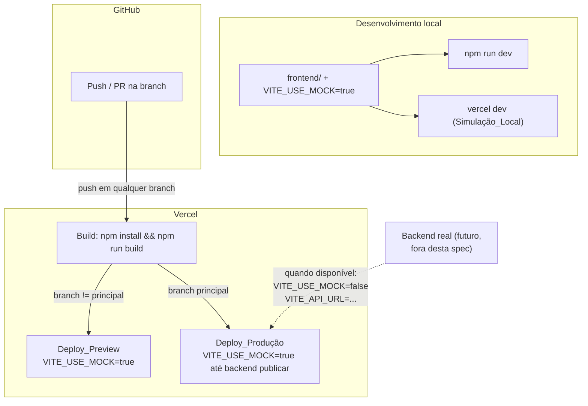
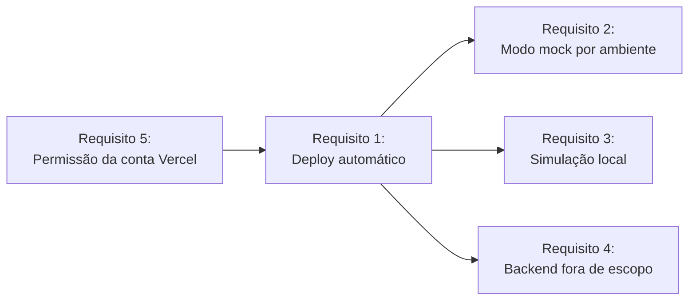

# Design Document: Deploy do Frontend na Vercel

## Overview

Este documento detalha como o frontend do Agenda Tech será publicado na Vercel, mantendo o modo
mock como caminho padrão até o backend real estar disponível, com uma camada de simulação local
para reduzir surpresas entre "funciona no meu computador" e "funciona no deploy". O backend fica
deliberadamente fora do escopo — ver Requisito 4 do `requirements.md`.

## Architecture



### Fluxo de dependências



O Requisito 5 (permissão) bloqueia todo o resto — é o item ativo pendente hoje (ver
`docs/development/build-log.md`).

## Components and Interfaces

### Componente 1: `vercel.json` (a criar na fase de implementação)

```jsonc
{
  "framework": "vite",
  "buildCommand": "npm run build",
  "outputDirectory": "dist",
  "installCommand": "npm install",
  // rewrites necessários porque é uma SPA com client-side routing (react-router-dom)
  "rewrites": [{ "source": "/(.*)", "destination": "/index.html" }]
}
```

Vive em `frontend/vercel.json` (root directory do projeto na Vercel = `frontend/`). O rewrite
para `index.html` é obrigatório — sem ele, recarregar a página em `/comunidades/123` retorna 404
da Vercel em vez de deixar o `react-router-dom` resolver a rota no cliente.

### Componente 2: Variáveis de ambiente por ambiente Vercel

| Variável | Development | Preview | Production (hoje) | Production (pós-backend) |
|---|---|---|---|---|
| `VITE_USE_MOCK` | `true` | `true` | `true` | `false` |
| `VITE_API_URL` | não setado (proxy Vite local) | não setado | não setado | URL do backend real |

A tabela acima **é** a especificação — quando o backend publicar, só a última coluna muda, via
painel da Vercel ou `vercel env`, sem tocar em código.

### Componente 3: Simulação local (`vercel dev`)

```bash
cd frontend
npm i -g vercel   # ou usar via npx
vercel link        # associa a pasta local ao Vercel_Project (uma vez)
vercel env pull .env.local   # traz as env vars configuradas no painel
vercel dev          # serve localmente replicando o comportamento de build da Vercel
```

Isso substitui (não convive com) o `npm run dev` padrão quando o objetivo é validar
especificamente o comportamento de deploy (rewrites, env vars por ambiente) — para
desenvolvimento do dia a dia, `npm run dev` continua sendo mais rápido (HMR nativo do Vite).

## Data Models

Não aplicável — esta spec não introduz modelos de dados novos, é infraestrutura de deploy.

## Error Handling

| Situação | Mitigação |
|---|---|
| Build falha na Vercel (`tsc`/`vite build`) | Deployment marcado como falho, `Deploy_Produção` anterior preservado (comportamento nativo da Vercel — não precisa de configuração extra) |
| `VITE_USE_MOCK` não definido em um ambiente novo | Tratado como `false` pelo código (`MOCK_ENABLED = import.meta.env.VITE_USE_MOCK === 'true'`) — falha seguro: sem a env var, tenta a API real e mostra erro de rede visível, não mostra dado mockado por engano |
| Rota SPA retorna 404 sem o rewrite configurado | Coberto pelo `vercel.json` do Componente 1 — validado manualmente após a primeira implementação (navegar direto para uma rota profunda, tipo `/eventos/:id`, no Deploy_Preview) |
| Permissão de criar projeto ausente (já observado) | Ver Requisito 5 — bloqueia a implementação até resolvido, não há workaround aceitável |

## Testing Strategy

Infraestrutura de deploy não tem testes automatizados tradicionais. Validação é manual e
pontual, na primeira implementação:

1. **Smoke test do Deploy_Preview**: abrir a URL gerada, navegar pelas rotas principais
   (`/comunidades`, `/eventos`, `/calendario`), confirmar que o modo mock está ativo (badge
   "dados de demonstração" visível) e que não há erros de console.
2. **Teste de rota profunda**: acessar diretamente uma URL como `/comunidades/algum-id` (sem
   passar pela navegação da SPA) e confirmar que o `vercel.json` resolve corretamente em vez de
   retornar 404.
3. **Teste de alternância de ambiente**: confirmar no painel da Vercel que `VITE_USE_MOCK` pode
   ser lido/alterado por ambiente sem exigir novo deploy manual (a Vercel já faz isso nativamente
   — é validação de configuração, não de código).
