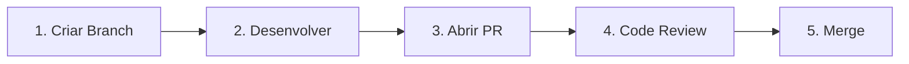
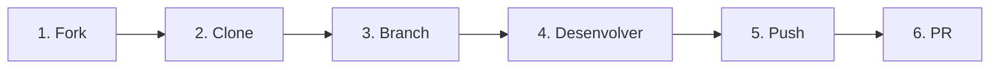

# Guia de Contribuição — Agenda Tech

Obrigado pelo interesse em contribuir com o **Agenda Tech**! Este documento descreve as regras, convenções e fluxos de trabalho que todos os contribuidores devem seguir para manter o projeto organizado e consistente.

## Sumário

- [Código de Conduta](#código-de-conduta)
- [Formatação e Linting](#formatação-e-linting)
- [Convenção de Commits](#convenção-de-commits)
- [Nomenclatura de Branches](#nomenclatura-de-branches)
- [Fluxo de Pull Request (contribuidores internos)](#fluxo-de-pull-request-contribuidores-internos)
- [Fluxo de Fork + PR (contribuidores externos)](#fluxo-de-fork--pr-contribuidores-externos)
- [Diretrizes de Code Review](#diretrizes-de-code-review)

---

## Código de Conduta

Ao contribuir com este projeto, você concorda em manter um ambiente respeitoso e colaborativo. Trate todos os participantes com respeito, independentemente de experiência, identidade ou origem.

---

## Formatação e Linting

Seguimos padrões de formatação automática para garantir consistência no código.

### Ferramentas

| Ferramenta | Propósito | Configuração |
|------------|-----------|--------------|
| **ESLint** | Análise estática e linting de código JavaScript/TypeScript | `.eslintrc.js` na raiz do projeto |
| **Prettier** | Formatação automática de código | `.prettierrc` na raiz do projeto |

### Regras Gerais

- **Indentação**: 2 espaços (nunca tabs)
- **Ponto e vírgula**: obrigatório no final de cada instrução
- **Aspas**: aspas simples (`'`) para strings em JavaScript/TypeScript
- **Vírgula final (trailing comma)**: obrigatória em objetos e arrays multiline
- **Tamanho máximo de linha**: 100 caracteres
- **Final de arquivo**: sempre incluir uma linha em branco no final

### Comandos

```bash
# Verificar erros de linting
npm run lint

# Corrigir erros automaticamente
npm run lint:fix

# Formatar código com Prettier
npm run format

# Verificar formatação sem aplicar mudanças
npm run format:check
```

### Dicas

- Configure seu editor para formatar ao salvar (Format on Save) usando a extensão do Prettier.
- Instale as extensões ESLint e Prettier no VS Code para feedback em tempo real.
- Nunca desabilite regras do ESLint sem discussão prévia no PR.

---

## Convenção de Commits

Utilizamos a especificação [Conventional Commits](https://www.conventionalcommits.org/pt-br/) para manter um histórico de commits claro e padronizado.

### Formato

```
<tipo>(escopo opcional): <descrição curta>

[corpo opcional]

[rodapé opcional]
```

### Tipos Permitidos

| Tipo | Quando usar | Exemplo |
|------|-------------|---------|
| `feat` | Nova funcionalidade | `feat(api): adicionar endpoint de listagem de eventos` |
| `fix` | Correção de bug | `fix(calendar): corrigir exibição de eventos no fuso horário` |
| `docs` | Alterações em documentação | `docs: atualizar README com instruções de setup` |
| `style` | Formatação (sem alteração de lógica) | `style: aplicar formatação do Prettier` |
| `refactor` | Refatoração (sem nova feature ou fix) | `refactor(auth): simplificar lógica de validação` |
| `test` | Adição ou correção de testes | `test(api): adicionar testes para CRUD de comunidades` |
| `chore` | Tarefas de manutenção | `chore: atualizar dependências do projeto` |
| `ci` | Alterações em CI/CD | `ci: adicionar step de linting no workflow` |
| `perf` | Melhorias de performance | `perf(query): otimizar consulta de eventos por data` |
| `build` | Alterações no sistema de build | `build: configurar path aliases no TypeScript` |

### Regras

1. **Descrição em letra minúscula**: não inicie com letra maiúscula
2. **Sem ponto final**: a descrição não termina com ponto
3. **Imperativo**: use o modo imperativo ("adicionar", não "adicionado" ou "adiciona")
4. **Máximo 72 caracteres** na primeira linha
5. **Escopo opcional**: use quando a mudança afeta um módulo específico (ex: `api`, `calendar`, `auth`)
6. **Breaking changes**: adicione `!` após o tipo ou use o rodapé `BREAKING CHANGE:`

### Exemplos Práticos

```bash
# Feature simples
git commit -m "feat: criar componente de card de evento"

# Fix com escopo
git commit -m "fix(frontend): corrigir overflow no calendário mobile"

# Docs
git commit -m "docs: adicionar seção de wireframes ao escopo funcional"

# Breaking change
git commit -m "feat(api)!: alterar formato de resposta do endpoint de eventos"

# Commit com corpo explicativo
git commit -m "refactor(backend): migrar validações para middleware

Move as validações de input dos controllers para middlewares
dedicados, reduzindo duplicação e facilitando testes unitários.

Closes #42"
```

---

## Nomenclatura de Branches

Utilize o seguinte padrão para nomes de branches:

### Formato

```
<tipo>/<descricao-curta>
```

### Tipos de Branch

| Prefixo | Quando usar | Exemplo |
|---------|-------------|---------|
| `feature/` | Nova funcionalidade | `feature/listagem-eventos` |
| `fix/` | Correção de bug | `fix/calendario-fuso-horario` |
| `docs/` | Alterações em documentação | `docs/atualizar-contributing` |
| `chore/` | Manutenção e configuração | `chore/atualizar-deps` |
| `ci/` | Alterações de CI/CD | `ci/adicionar-pipeline-testes` |
| `refactor/` | Refatoração | `refactor/simplificar-auth` |

### Regras

- Use **kebab-case** (palavras separadas por hífen)
- Mantenha nomes **curtos e descritivos** (máximo 50 caracteres)
- Nunca trabalhe diretamente na branch `main`
- Crie uma branch a partir da `main` atualizada

---

## Fluxo de Pull Request (contribuidores internos)

Para membros das comunidades com acesso de escrita ao repositório.

### Passo a Passo



#### 1. Criar Branch

```bash
# Atualize a main
git checkout main
git pull origin main

# Crie a branch de trabalho
git checkout -b feature/minha-funcionalidade
```

#### 2. Desenvolver

```bash
# Faça suas alterações
# Commite seguindo a convenção de commits
git add .
git commit -m "feat: implementar funcionalidade X"

# Mantenha sua branch atualizada com a main
git fetch origin
git rebase origin/main
```

#### 3. Abrir Pull Request

```bash
# Envie sua branch para o remoto
git push -u origin feature/minha-funcionalidade
```

- Abra um PR no GitHub apontando para a branch `main`
- Preencha o template de PR completamente
- Vincule a issue relacionada usando `Closes #numero`
- Adicione labels apropriadas (comunidade + camada técnica)
- Solicite review de pelo menos 1 membro

#### 4. Code Review

- Aguarde a revisão do código
- Responda aos comentários e faça as correções solicitadas
- Cada push adicional dispara os checks de CI automaticamente
- **Requisito**: mínimo de 1 aprovação para merge

#### 5. Merge

- Após aprovação e todos os checks de CI passando, faça o merge
- Utilize **Squash and Merge** para manter o histórico limpo
- Delete a branch após o merge

---

## Fluxo de Fork + PR (contribuidores externos)

Para contribuidores que não possuem acesso de escrita ao repositório.

### Passo a Passo



#### 1. Fork do Repositório

- Acesse o repositório no GitHub
- Clique no botão **Fork** no canto superior direito
- Isso cria uma cópia do repositório na sua conta

#### 2. Clone o Fork

```bash
# Clone o seu fork
git clone https://github.com/SEU-USUARIO/AgendaTech.git
cd AgendaTech

# Adicione o repositório original como remote "upstream"
git remote add upstream https://github.com/ORGANIZACAO/AgendaTech.git
```

#### 3. Crie uma Branch

```bash
# Sincronize com o upstream
git fetch upstream
git checkout -b feature/minha-contribuicao upstream/main
```

#### 4. Desenvolva

```bash
# Faça suas alterações seguindo as convenções do projeto
git add .
git commit -m "feat: minha contribuição"
```

#### 5. Push para o Fork

```bash
# Envie para o seu fork
git push -u origin feature/minha-contribuicao
```

#### 6. Abra o Pull Request

- Acesse seu fork no GitHub
- Clique em **"Compare & pull request"**
- Certifique-se de que o PR aponta para `main` do repositório original
- Preencha o template de PR
- Descreva suas alterações de forma clara

### Mantendo o Fork Atualizado

```bash
# Busque as atualizações do repositório original
git fetch upstream

# Atualize sua branch main local
git checkout main
git merge upstream/main

# Envie para o seu fork
git push origin main
```

---

## Diretrizes de Code Review

### Para quem solicita review

- Mantenha PRs **pequenos e focados** (idealmente menos de 400 linhas alteradas)
- Forneça **contexto** na descrição do PR sobre o que foi feito e por quê
- Inclua **screenshots** ou GIFs para mudanças visuais
- Garanta que todos os **checks de CI passam** antes de solicitar review
- Responda aos comentários de forma construtiva e faça as alterações necessárias

### Para quem faz review

- Seja **respeitoso e construtivo** nos comentários
- Foque em:
  - Correção lógica e funcional
  - Aderência às convenções do projeto
  - Performance e segurança
  - Legibilidade e manutenibilidade
  - Cobertura de testes
- Use prefixos nos comentários para indicar severidade:
  - `[blocking]` — Deve ser corrigido antes do merge
  - `[suggestion]` — Sugestão de melhoria (não bloqueia merge)
  - `[question]` — Pedido de esclarecimento
  - `[nit]` — Detalhe menor / nitpick (não bloqueia merge)
- Aprove o PR somente quando estiver confiante de que as alterações estão corretas

### Checklist de Revisão

- [ ] O código segue as convenções de formatação e linting
- [ ] Os commits seguem a convenção de Conventional Commits
- [ ] Testes foram adicionados ou atualizados
- [ ] A documentação foi atualizada (se aplicável)
- [ ] Não há código morto ou comentários desnecessários
- [ ] Não há credenciais ou dados sensíveis no código
- [ ] O PR está vinculado a uma issue

---

## Dúvidas?

Se tiver dúvidas sobre como contribuir, abra uma issue com a label `dúvida` ou entre em contato com os membros da comunidade responsável pelo módulo que deseja contribuir.

- **DEVPIRA**: Organização e gestão
- **DevLimeira**: Backend
- **DevRioClaro**: CI/CD e testes
- **DevItape**: Frontend
