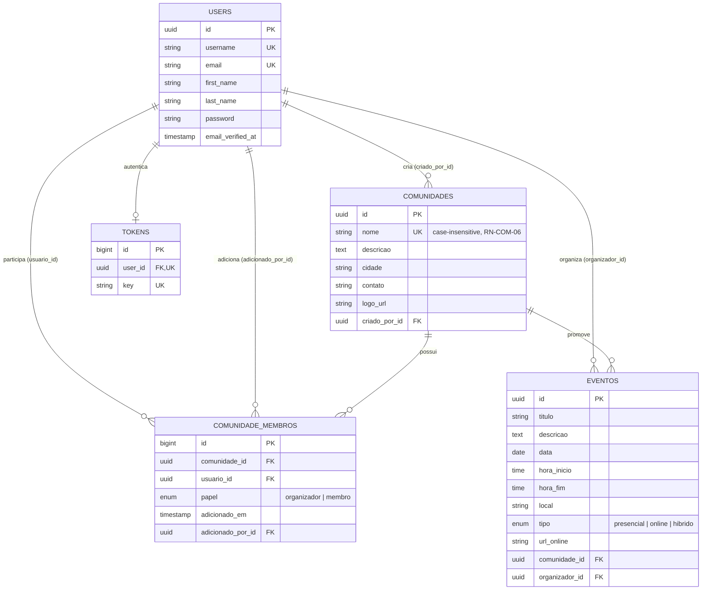

# Diagrama ER — Agenda Tech (Backend)

> Referente à tarefa [2.1 Modelagem de Dados](../backend/laravel/database/migrations) (DevLimeira, MS2: Backend API).
> Schema implementado em `backend/laravel/database/migrations` (Laravel 11 / PostgreSQL, ver [`docs/stack.md`](./stack.md)).

## Diagrama

## Cardinalidades

| Relacionamento | Cardinalidade | Observação |
|---|---|---|
| Comunidade → Eventos | 1:N | `eventos.comunidade_id`, `cascadeOnDelete` |
| Comunidade ↔ Usuários (membros) | N:M | via `comunidade_membros`, pivot com `papel` (`organizador`/`membro`) — implementa o papel de "Organizador" da comunidade, em vez de uma entidade `Organizador` separada |
| Usuário → Eventos (organizador) | 1:N | `eventos.organizador_id`, `restrictOnDelete` |
| Usuário → Comunidades (criador) | 1:N | `comunidades.criado_por_id`, `restrictOnDelete` |
| Usuário → Token | 1:1 | `tokens.user_id`, único |

## Constraints e regras de negócio refletidas no schema

| Regra | Onde está implementada |
|---|---|
| RN-COM-06 — nome de comunidade único (case-insensitive) | Índice único `comunidades_nome_ci_unique` (collation `NOCASE` no SQLite; `unique('nome')` nos demais drivers) |
| RN-EVT-09 — evento não pode duplicar título+data na mesma comunidade | Índice único composto `unique_evento_titulo_data_por_comunidade` (`comunidade_id`, `titulo`, `data`) |
| Um usuário não pode ser membro duplicado da mesma comunidade | Índice único composto `unique_membro_por_comunidade` (`comunidade_id`, `usuario_id`) |
| RN-COM-08 — criador de uma comunidade é automaticamente seu organizador | Aplicado em `ComunidadeController::store` (camada de aplicação, não no schema) |

## Nota sobre desvio em relação ao WBS original

O texto de critérios de aceitação da issue #20 (copiado de `docs/wbs.md`) lista os campos `website` e `data_criacao` em `Comunidade`, e uma entidade `Organizador` separada. O schema implementado segue a versão mais recente e detalhada da spec funcional (`docs/escopo-funcional.md`, seção 2.5 "Regras de Negócio", RN-COM-01 a RN-COM-10), que substitui `website`/`data_criacao` por `cidade`/`contato` e resolve "organizador" como um **papel** dentro de `comunidade_membros`, não como entidade própria. `docs/wbs.md` está desatualizado nesse ponto — vale alinhar numa próxima revisão do WBS.
