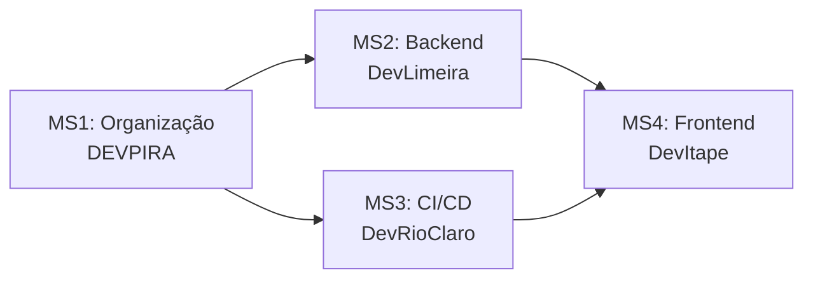
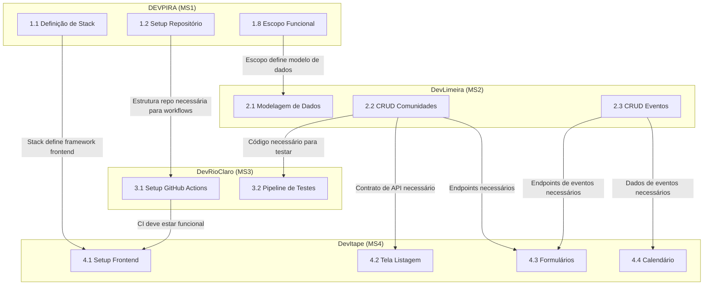
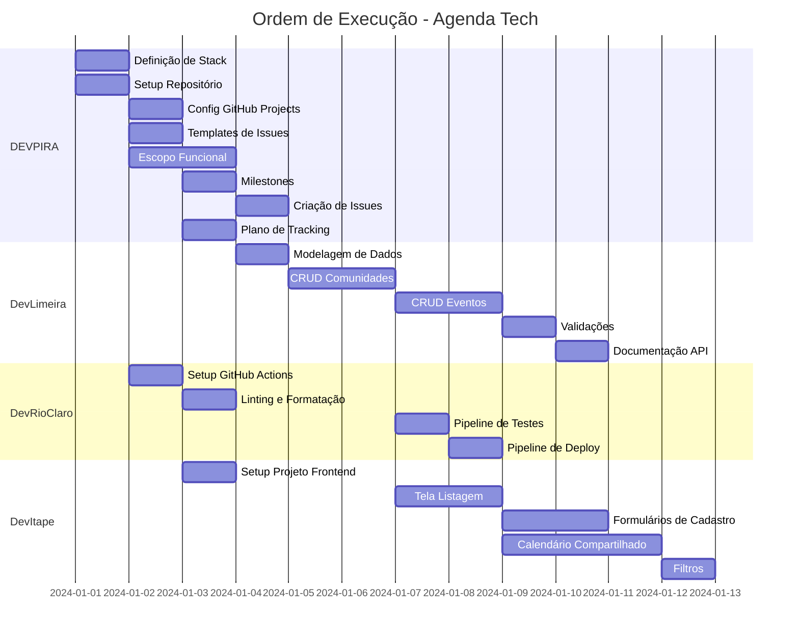

# Work Breakdown Structure (WBS) — Agenda Tech

## Visão Geral

Este documento apresenta a **Work Breakdown Structure** completa do projeto Agenda Tech, decompondo o trabalho por comunidade participante. Cada tarefa inclui seu entregável, critério de conclusão e dependências.

**Comunidades participantes:**

| Comunidade | Responsabilidade | Milestone |
|------------|-----------------|-----------|
| **DEVPIRA** | Organização e gestão de projeto | MS1: Organização do Projeto |
| **DevLimeira** | Backend (APIs e dados) | MS2: Backend API |
| **DevRioClaro** | CI/CD e testes | MS3: CI/CD e Testes |
| **DevItape** | Frontend (interface) | MS4: Frontend |

---

## Diagrama Visual da WBS

```mermaid
graph TD
    ROOT[🗓️ Agenda Tech] --> WBS1[🟣 DEVPIRA<br/>Organização]
    ROOT --> WBS2[🟢 DevLimeira<br/>Backend]
    ROOT --> WBS3[🔴 DevRioClaro<br/>CI/CD]
    ROOT --> WBS4[🔵 DevItape<br/>Frontend]

    WBS1 --> T1A[1.1 Definição de Stack]
    WBS1 --> T1B[1.2 Setup Repositório]
    WBS1 --> T1C[1.3 Config GitHub Projects]
    WBS1 --> T1D[1.4 Templates de Issues]
    WBS1 --> T1E[1.5 Milestones]
    WBS1 --> T1F[1.6 Criação de Issues WBS]
    WBS1 --> T1G[1.7 Plano de Tracking]
    WBS1 --> T1H[1.8 Escopo Funcional]

    WBS2 --> T2A[2.1 Modelagem de Dados]
    WBS2 --> T2B[2.2 CRUD Comunidades]
    WBS2 --> T2C[2.3 CRUD Eventos]
    WBS2 --> T2D[2.4 Validações]
    WBS2 --> T2E[2.5 Documentação API]

    WBS3 --> T3A[3.1 Setup GitHub Actions]
    WBS3 --> T3B[3.2 Pipeline de Testes]
    WBS3 --> T3C[3.3 Pipeline de Deploy]
    WBS3 --> T3D[3.4 Linting e Formatação]

    WBS4 --> T4A[4.1 Setup Projeto Frontend]
    WBS4 --> T4B[4.2 Tela Listagem Comunidades]
    WBS4 --> T4C[4.3 Formulários de Cadastro]
    WBS4 --> T4D[4.4 Calendário Compartilhado]
    WBS4 --> T4E[4.5 Filtros]
```



---

## Fluxo de Dependências entre Milestones



**Ordem de execução:**
1. **MS1** (DEVPIRA) — Primeiro, sem dependências externas
2. **MS2** (DevLimeira) e **MS3** (DevRioClaro) — Em paralelo, dependem de MS1
3. **MS4** (DevItape) — Último, depende de MS2 e MS3

---

## Definição dos Milestones

Esta seção detalha cada milestone do projeto com objetivo, issues incluídas, critérios de conclusão, data-limite e dependências.

### Ordem de Dependência

```
MS1 (DEVPIRA) ──┬──→ MS2 (DevLimeira) ──┐
                │                         ├──→ MS4 (DevItape)
                └──→ MS3 (DevRioClaro) ──┘
```

- **MS1** é executado primeiro, sem dependências externas
- **MS2** e **MS3** são executados em paralelo, ambos dependem de MS1
- **MS4** é executado por último, depende da conclusão de MS2 e MS3

---

### MS1: Organização do Projeto (DEVPIRA)

| Campo | Detalhe |
|-------|---------|
| **Comunidade** | DEVPIRA |
| **Labels** | `devpira`, `organizacao` |
| **Objetivo** | Repositório completamente estruturado, GitHub Projects board configurado com automações, todas as issues da WBS criadas e associadas a milestones, documentação de escopo funcional concluída e plano de tracking pronto para apresentação. |
| **Data-limite** | Dia 1 do evento (primeira fase — pré-requisito para todas as demais comunidades) |
| **Dependências** | Nenhuma — MS1 é o ponto de partida do projeto |

**Issues incluídas:**

| # | Issue | Estimativa | Prioridade |
|---|-------|-----------|------------|
| 1.1 | Definição de Stack (`docs/stack.md`) | 3 pontos | Alta |
| 1.2 | Setup Repositório (estrutura + README + CONTRIBUTING + LICENSE) | 3 pontos | Alta |
| 1.3 | Configuração do GitHub Projects (board, labels, campos, automações) | 5 pontos | Alta |
| 1.4 | Templates de Issues (feature, bug, infra) + PR template | 3 pontos | Média |
| 1.5 | Criação dos 4 Milestones no GitHub | 2 pontos | Média |
| 1.6 | Criação de Issues da WBS (todas as tarefas como issues) | 5 pontos | Média |
| 1.7 | Plano de Tracking (`docs/tracking-plan.md`) | 3 pontos | Baixa |
| 1.8 | Escopo Funcional (`docs/escopo-funcional.md`) | 8 pontos | Alta |

**Critérios de conclusão:**

- [x] Estrutura de diretórios do repositório conforme especificação
- [x] README.md, CONTRIBUTING.md e LICENSE presentes e completos
- [x] GitHub Projects board operacional com 4 colunas, labels e campos customizados
- [x] Automação de board funcional (issue com label → To Do)
- [x] 3 templates de issue + PR template validados
- [x] 4 milestones criados com descrições e due dates
- [x] Todas as 22 issues da WBS criadas com labels e milestones associados
- [x] Documento de stack com todas as camadas documentadas
- [x] Documento de escopo funcional completo (módulos, API, telas, regras)
- [x] Plano de tracking com roteiro da apresentação e checklist

**Total:** 8 tarefas / 32 story points

---

### MS2: Backend API (DevLimeira)

| Campo | Detalhe |
|-------|---------|
| **Comunidade** | DevLimeira |
| **Labels** | `devlimeira`, `backend` |
| **Objetivo** | Endpoints CRUD funcionais para comunidades e eventos com validações completas, banco de dados modelado e documentação da API disponível para consumo pelo frontend. |
| **Data-limite** | Dia 2 do evento (segunda fase — paralelo com MS3, após conclusão de MS1) |
| **Dependências** | MS1: Organização do Projeto (precisa da estrutura do repositório, definição de stack e escopo funcional concluídos) |

**Issues incluídas:**

| # | Issue | Estimativa | Prioridade |
|---|-------|-----------|------------|
| 2.1 | Modelagem de Dados (schema, entidades, relacionamentos, migrations) | 5 pontos | Alta |
| 2.2 | CRUD Comunidades (endpoints REST completos) | 5 pontos | Alta |
| 2.3 | CRUD Eventos (endpoints REST com filtros) | 5 pontos | Média |
| 2.4 | Validações (campos, formatos, relacionamentos, mensagens de erro) | 3 pontos | Média |
| 2.5 | Documentação API (todos os endpoints com exemplos) | 3 pontos | Baixa |

**Critérios de conclusão:**

- [ ] Schema do banco de dados definido com entidades Comunidade, Evento e Organizador
- [ ] Endpoints CRUD para `/api/comunidades` operacionais (GET, POST, PUT, DELETE)
- [ ] Endpoints CRUD para `/api/eventos` operacionais com filtros por data e comunidade
- [ ] Validações de campos obrigatórios, formatos e relacionamentos implementadas
- [ ] Mensagens de erro padronizadas em JSON
- [ ] Códigos de status HTTP corretos para cada cenário (200, 201, 400, 404, 500)
- [ ] Documentação da API completa com exemplos de uso
- [ ] Todos os endpoints testáveis via ferramentas como curl ou Postman

**Total:** 5 tarefas / 21 story points

---

### MS3: CI/CD e Testes (DevRioClaro)

| Campo | Detalhe |
|-------|---------|
| **Comunidade** | DevRioClaro |
| **Labels** | `devrioclaro`, `ci-cd` |
| **Objetivo** | Pipelines de integração contínua e deploy configurados com GitHub Actions, testes automatizados executando em cada PR, linting e formatação garantidos automaticamente. |
| **Data-limite** | Dia 2 do evento (segunda fase — paralelo com MS2, após conclusão de MS1) |
| **Dependências** | MS1: Organização do Projeto (precisa da estrutura do repositório e workflows base para configurar pipelines) |

**Issues incluídas:**

| # | Issue | Estimativa | Prioridade |
|---|-------|-----------|------------|
| 3.1 | Setup GitHub Actions (workflows base, triggers, runner) | 3 pontos | Alta |
| 3.2 | Pipeline de Testes (testes unitários no CI, cobertura, check obrigatório) | 5 pontos | Média |
| 3.3 | Pipeline de Deploy (deploy automatizado, staging, notificações) | 5 pontos | Baixa |
| 3.4 | Linting e Formatação (Laravel Pint, PHPStan, checks no CI) | 3 pontos | Média |

**Critérios de conclusão:**

- [ ] Workflow de CI configurado em `.github/workflows/` com triggers em push e PR para main
- [ ] Testes unitários do backend e frontend executando automaticamente no CI
- [ ] Relatório de cobertura gerado (target mínimo: 70%)
- [ ] Check de testes configurado como obrigatório para merge
- [ ] Pipeline de deploy ativado em merge na main com deploy para staging
- [ ] Laravel Pint e PHPStan configurados e executando no CI
- [ ] Falhas de linting e testes bloqueiam merge de PRs
- [ ] Configurações locais (`pint.json`, `.phpstan.neon`) alinhadas com CI

**Total:** 4 tarefas / 16 story points

---

### MS4: Frontend (DevItape)

| Campo | Detalhe |
|-------|---------|
| **Comunidade** | DevItape |
| **Labels** | `devitape`, `frontend` |
| **Objetivo** | Telas do Agenda Tech implementadas e funcionais com integração à API do backend, incluindo listagem de comunidades, formulários de cadastro, calendário compartilhado interativo e sistema de filtros. |
| **Data-limite** | Dia 3 do evento (terceira fase — após conclusão de MS2 e MS3) |
| **Dependências** | MS2: Backend API (contratos de API necessários para integração) e MS3: CI/CD e Testes (CI funcional para validar PRs do frontend) |

**Issues incluídas:**

| # | Issue | Estimativa | Prioridade |
|---|-------|-----------|------------|
| 4.1 | Setup Projeto Frontend (framework, estrutura, linting, dev server) | 3 pontos | Alta |
| 4.2 | Tela Listagem Comunidades (cards, integração API, loading, responsivo) | 5 pontos | Média |
| 4.3 | Formulários de Cadastro (comunidades e eventos, validação, feedback) | 5 pontos | Média |
| 4.4 | Calendário Compartilhado (visualização mensal, navegação, cores por comunidade) | 8 pontos | Média |
| 4.5 | Filtros (por comunidade, período, texto, query params, persistência) | 5 pontos | Baixa |

**Critérios de conclusão:**

- [ ] Projeto frontend inicializado com framework da stack e rodando localmente
- [ ] Tela de listagem de comunidades funcional com integração à API
- [ ] Formulários de cadastro de comunidade e evento com validação frontend
- [ ] Calendário compartilhado com visualização mensal e navegação entre meses
- [ ] Eventos exibidos no calendário com cores por comunidade
- [ ] Sistema de filtros (comunidade, período, texto) funcional
- [ ] Filtros refletidos na URL via query parameters
- [ ] Design responsivo (mobile e desktop) em todas as telas
- [ ] Estados de loading, vazio e erro tratados adequadamente

**Total:** 5 tarefas / 26 story points

---

### Resumo dos Milestones

| Milestone | Comunidade | Tarefas | Story Points | Data-limite | Depende de |
|-----------|-----------|---------|--------------|-------------|------------|
| MS1: Organização do Projeto | DEVPIRA | 8 | 32 | Dia 1 | — |
| MS2: Backend API | DevLimeira | 5 | 21 | Dia 2 | MS1 |
| MS3: CI/CD e Testes | DevRioClaro | 4 | 16 | Dia 2 | MS1 |
| MS4: Frontend | DevItape | 5 | 26 | Dia 3 | MS2, MS3 |
| **TOTAL** | **4 comunidades** | **22** | **95** | — | — |

---

## 1. DEVPIRA — Organização e Gestão de Projeto

**Milestone:** MS1: Organização do Projeto  
**Labels:** `devpira`, `organizacao`  
**Objetivo:** Repositório estruturado, board configurado, issues criadas, plano de tracking pronto

### Tabela de Tarefas

| # | Tarefa | Entregável | Critério de Conclusão | Dependências | Estimativa |
|---|--------|------------|----------------------|--------------|------------|
| 1.1 | Definição de Stack | Documento `docs/stack.md` com stack completa | Documento contém: tecnologia, versão, finalidade e justificativa para cada camada (backend, frontend, BD, CI/CD); pré-requisitos de ambiente listados; instruções de setup com comando de verificação | Nenhuma | 3 pontos |
| 1.2 | Setup Repositório | Estrutura de diretórios criada, README, CONTRIBUTING, LICENSE | Repositório possui: `.github/ISSUE_TEMPLATE/`, `docs/`, `backend/`, `frontend/`, `infra/`; README com propósito, stack, estrutura e link para CONTRIBUTING; CONTRIBUTING com regras de commits, linting e fluxo de PR; LICENSE MIT presente | Nenhuma | 3 pontos |
| 1.3 | Config GitHub Projects | Board do GitHub Projects configurado | Board com 4 colunas (To Do, In Progress, Review, Done); labels de comunidade e camada criadas; campos customizados (prioridade, estimativa) configurados; automação de issue com label → To Do ativa | 1.2 Setup Repositório | 5 pontos |
| 1.4 | Templates de Issues | 3 templates YAML + PR template | Templates `feature.yml`, `bug.yml`, `infra.yml` com campos obrigatórios via `validations.required: true`; `PULL_REQUEST_TEMPLATE.md` com seções de descrição, tipo, checklist e issue relacionada | 1.2 Setup Repositório | 3 pontos |
| 1.5 | Milestones | 4 milestones criados no GitHub | Milestones MS1-MS4 criados com: descrição (objetivo + critérios de conclusão), due dates definidas, dependências documentadas na descrição | 1.3 Config GitHub Projects | 2 pontos |
| 1.6 | Criação de Issues WBS | Issues criadas para cada item da WBS | Todas as tarefas da WBS possuem issue correspondente com: labels (comunidade + camada), milestone associado, campos customizados preenchidos | 1.4 Templates, 1.5 Milestones | 5 pontos |
| 1.7 | Plano de Tracking | Documento `docs/tracking-plan.md` | Documento contém: indicadores de progresso, fluxo de trabalho com transições, views do GitHub Projects, roteiro da apresentação com duração por bloco, checklist pré-apresentação | 1.3 Config GitHub Projects | 3 pontos |
| 1.8 | Escopo Funcional | Documento `docs/escopo-funcional.md` | Documento contém: funcionalidades por módulo, modelo de dados, endpoints de API, especificação de telas, regras de negócio, critérios de aceitação (Given-When-Then), papéis de usuário e permissões | 1.1 Definição de Stack | 8 pontos |

### Detalhamento das Tarefas DEVPIRA

#### 1.1 Definição de Stack

- **Entregável:** Documento `docs/stack.md` completo
- **Critério de Conclusão:**
  - [x] Cada camada (backend, frontend, BD, CI/CD) possui: nome da tecnologia, versão, finalidade
  - [x] Justificativa de escolha documentada para cada tecnologia
  - [x] Pré-requisitos de ambiente com versões exatas
  - [x] Instruções de setup local com comando de verificação
- **Dependências:** Nenhuma

#### 1.2 Setup Repositório

- **Entregável:** Repositório com estrutura de diretórios completa e documentação base
- **Critério de Conclusão:**
  - [x] Diretórios `.github/ISSUE_TEMPLATE/`, `docs/wireframes/`, `backend/`, `frontend/`, `infra/` existem
  - [x] README.md com seções: propósito, stack, estrutura de pastas, link CONTRIBUTING
  - [x] CONTRIBUTING.md com: formatação/linting, Conventional Commits, fluxo de PR, fork workflow
  - [x] LICENSE MIT presente na raiz
- **Dependências:** Nenhuma

#### 1.3 Config GitHub Projects

- **Entregável:** Board do GitHub Projects totalmente configurado
- **Critério de Conclusão:**
  - [x] 4 colunas: To Do → In Progress → Review → Done
  - [x] Labels de comunidade: `devpira`, `devlimeira`, `devrioclaro`, `devitape`
  - [x] Labels de camada: `organizacao`, `backend`, `ci-cd`, `frontend`
  - [x] Campos customizados: prioridade (alta/média/baixa), estimativa (1/2/3/5/8)
  - [x] Automação configurada: issue com label de comunidade → To Do
- **Dependências:** 1.2 Setup Repositório

#### 1.4 Templates de Issues

- **Entregável:** Templates YAML para issues e template de PR
- **Critério de Conclusão:**
  - [x] `feature.yml` com campos: descrição, critérios de aceitação, comunidade (dropdown), estimativa (dropdown)
  - [x] `bug.yml` com campos: descrição, passos, esperado, atual; label `bug` pré-configurada
  - [x] `infra.yml` com campos: descrição, impacto, dependências; label `ci-cd` pré-configurada
  - [x] `PULL_REQUEST_TEMPLATE.md` com seções adequadas
  - [x] Todos os campos com `validations.required: true`
- **Dependências:** 1.2 Setup Repositório

#### 1.5 Milestones

- **Entregável:** 4 milestones configurados no GitHub
- **Critério de Conclusão:**
  - [x] MS1: Organização do Projeto (DEVPIRA) criado
  - [x] MS2: Backend API (DevLimeira) criado
  - [x] MS3: CI/CD e Testes (DevRioClaro) criado
  - [x] MS4: Frontend (DevItape) criado
  - [x] Cada milestone possui: descrição, due date, dependências documentadas
- **Dependências:** 1.3 Config GitHub Projects

#### 1.6 Criação de Issues WBS

- **Entregável:** Todas as issues da WBS criadas no repositório
- **Critério de Conclusão:**
  - [x] Issue criada para cada tarefa listada neste documento
  - [x] Labels de comunidade e camada atribuídas em cada issue
  - [x] Milestone associado corretamente
  - [ ] Campos customizados (prioridade, estimativa) preenchidos
- **Dependências:** 1.4 Templates de Issues, 1.5 Milestones

#### 1.7 Plano de Tracking

- **Entregável:** Documento `docs/tracking-plan.md`
- **Critério de Conclusão:**
  - [x] Indicadores definidos: issues abertas vs fechadas, % por milestone, distribuição por comunidade
  - [x] Fluxo de trabalho documentado com triggers de transição
  - [x] Views do GitHub Projects especificadas (comunidade, prioridade, timeline)
  - [x] Roteiro da apresentação com duração por bloco (total 40 min)
  - [x] Checklist pré-apresentação completo
- **Dependências:** 1.3 Config GitHub Projects

#### 1.8 Escopo Funcional

- **Entregável:** Documento `docs/escopo-funcional.md`
- **Critério de Conclusão:**
  - [x] Módulos documentados: comunidades, eventos, calendário, organizadores
  - [x] Modelo de dados por módulo (entidades, atributos, relacionamentos)
  - [x] Endpoints de API especificados (método, rota, parâmetros, resposta, status codes)
  - [x] Telas do frontend especificadas (componentes, dados, ações, navegação)
  - [x] Regras de negócio documentadas (validações, permissões, cardinalidade)
  - [x] Critérios de aceitação Given-When-Then (min. 1 sucesso + 1 erro por funcionalidade)
  - [x] Papéis de usuário (organizador, membro, visitante) e permissões por módulo
- **Dependências:** 1.1 Definição de Stack

---

## 2. DevLimeira — Backend (APIs e Dados)

**Milestone:** MS2: Backend API  
**Labels:** `devlimeira`, `backend`  
**Objetivo:** Endpoints CRUD funcionais para comunidades e eventos, documentação da API

### Tabela de Tarefas

| # | Tarefa | Entregável | Critério de Conclusão | Dependências | Estimativa |
|---|--------|------------|----------------------|--------------|------------|
| 2.1 | Modelagem de Dados | Schema do banco de dados definido | Entidades documentadas (comunidades, eventos, organizadores) com atributos, tipos e relacionamentos; migrations ou schema file criado; diagrama ER disponível | MS1 concluído; 1.8 Escopo Funcional | 5 pontos |
| 2.2 | CRUD Comunidades | Endpoints CRUD para comunidades | Endpoints GET/POST/PUT/DELETE para `/api/comunidades` implementados e funcionais; validações de entrada aplicadas; respostas seguem formato padronizado | 2.1 Modelagem de Dados | 5 pontos |
| 2.3 | CRUD Eventos | Endpoints CRUD para eventos | Endpoints GET/POST/PUT/DELETE para `/api/eventos` implementados e funcionais; associação com comunidade validada; filtros por data e comunidade disponíveis | 2.1 Modelagem de Dados, 2.2 CRUD Comunidades | 5 pontos |
| 2.4 | Validações | Validações de negócio implementadas | Campos obrigatórios validados; formatos (email, data, URL) validados; mensagens de erro padronizadas; códigos de status HTTP corretos para cada cenário | 2.2 CRUD Comunidades, 2.3 CRUD Eventos | 3 pontos |
| 2.5 | Documentação API | Documentação completa da API | Todos os endpoints documentados com: método, rota, parâmetros, corpo da requisição, formato de resposta, códigos de status; exemplos de uso incluídos | 2.2, 2.3, 2.4 | 3 pontos |

### Detalhamento das Tarefas DevLimeira

#### 2.1 Modelagem de Dados

- **Entregável:** Schema do banco de dados com entidades, atributos e relacionamentos
- **Critério de Conclusão:**
  - [ ] Entidade `Comunidade` definida (id, nome, descricao, logo_url, website, data_criacao)
  - [ ] Entidade `Evento` definida (id, titulo, descricao, data_inicio, data_fim, local, comunidade_id)
  - [ ] Entidade `Organizador` definida (id, nome, email, comunidade_id, papel)
  - [ ] Relacionamentos definidos com cardinalidade (1:N comunidade→eventos, N:M comunidade→organizadores)
  - [ ] Migrations ou schema file criado
  - [ ] Diagrama ER documentado
- **Dependências:** MS1 concluído, 1.8 Escopo Funcional

#### 2.2 CRUD Comunidades

- **Entregável:** Endpoints REST completos para gerenciamento de comunidades
- **Critério de Conclusão:**
  - [ ] `GET /api/comunidades` — listar todas as comunidades
  - [ ] `GET /api/comunidades/:id` — buscar comunidade por ID
  - [ ] `POST /api/comunidades` — criar nova comunidade
  - [ ] `PUT /api/comunidades/:id` — atualizar comunidade existente
  - [ ] `DELETE /api/comunidades/:id` — remover comunidade
  - [ ] Respostas com status codes corretos (200, 201, 400, 404, 500)
  - [ ] Formato de resposta padronizado (JSON com data e meta)
- **Dependências:** 2.1 Modelagem de Dados

#### 2.3 CRUD Eventos

- **Entregável:** Endpoints REST completos para gerenciamento de eventos
- **Critério de Conclusão:**
  - [ ] `GET /api/eventos` — listar eventos (com filtros: data, comunidade)
  - [ ] `GET /api/eventos/:id` — buscar evento por ID
  - [ ] `POST /api/eventos` — criar novo evento (vinculado a uma comunidade)
  - [ ] `PUT /api/eventos/:id` — atualizar evento existente
  - [ ] `DELETE /api/eventos/:id` — remover evento
  - [ ] Filtros por query parameters: `?comunidade_id=`, `?data_inicio=`, `?data_fim=`
  - [ ] Validação de que `comunidade_id` referencia comunidade existente
- **Dependências:** 2.1 Modelagem de Dados, 2.2 CRUD Comunidades

#### 2.4 Validações

- **Entregável:** Camada de validação de dados implementada
- **Critério de Conclusão:**
  - [ ] Campos obrigatórios retornam 400 com mensagem específica quando ausentes
  - [ ] Validação de formato: email, URL, datas (ISO 8601)
  - [ ] Validação de comprimento: nome (3-100 chars), descrição (máx 1000 chars)
  - [ ] Validação de relacionamento: comunidade_id deve existir ao criar evento
  - [ ] Mensagens de erro padronizadas em formato JSON `{ "error": { "code": "...", "message": "..." } }`
- **Dependências:** 2.2 CRUD Comunidades, 2.3 CRUD Eventos

#### 2.5 Documentação API

- **Entregável:** Documentação completa e atualizada da API REST
- **Critério de Conclusão:**
  - [ ] Todos os endpoints documentados com método, rota e descrição
  - [ ] Parâmetros de entrada (path, query, body) documentados com tipo e obrigatoriedade
  - [ ] Formato de resposta documentado com exemplos JSON
  - [ ] Códigos de status documentados para cada endpoint (sucesso e erro)
  - [ ] Exemplos de uso com curl ou similar
  - [ ] Documentação acessível no repositório (`docs/` ou gerada automaticamente)
- **Dependências:** 2.2, 2.3, 2.4

---

## 3. DevRioClaro — CI/CD e Testes

**Milestone:** MS3: CI/CD e Testes  
**Labels:** `devrioclaro`, `ci-cd`  
**Objetivo:** Pipelines de CI/CD configurados, testes automatizados rodando, linting

### Tabela de Tarefas

| # | Tarefa | Entregável | Critério de Conclusão | Dependências | Estimativa |
|---|--------|------------|----------------------|--------------|------------|
| 3.1 | Setup GitHub Actions | Workflows base configurados | Arquivo `.github/workflows/` com workflow de CI ativado em push e pull_request para main; jobs executando com sucesso em runner Ubuntu; estrutura de steps definida | MS1 concluído; estrutura do repositório definida | 3 pontos |
| 3.2 | Pipeline de Testes | Pipeline de testes automatizados | Testes unitários executando no CI em cada PR; relatório de cobertura gerado; check de testes como obrigatório para merge; testes do backend e frontend executando | 3.1 Setup GitHub Actions, 2.2 CRUD Comunidades | 5 pontos |
| 3.3 | Pipeline de Deploy | Pipeline de deploy configurado | Workflow de deploy ativado em merge na main; deploy automatizado para ambiente de staging/preview; notificação de status de deploy | 3.1 Setup GitHub Actions, 3.2 Pipeline de Testes | 5 pontos |
| 3.4 | Linting e Formatação | Checks de linting e formatação no CI | ESLint configurado para frontend; linter configurado para backend; Prettier para formatação; checks bloqueiam merge se falham; configuração compartilhada entre local e CI | 3.1 Setup GitHub Actions | 3 pontos |

### Detalhamento das Tarefas DevRioClaro

#### 3.1 Setup GitHub Actions

- **Entregável:** Estrutura base de workflows do GitHub Actions
- **Critério de Conclusão:**
  - [ ] Diretório `.github/workflows/` com arquivo de workflow CI
  - [ ] Workflow trigger em `push` (main) e `pull_request` (main)
  - [ ] Runner configurado (ubuntu-latest)
  - [ ] Steps básicos: checkout, setup de runtime, instalação de dependências
  - [ ] Workflow executando com sucesso (green check)
- **Dependências:** MS1 concluído, estrutura do repositório definida

#### 3.2 Pipeline de Testes

- **Entregável:** Pipeline de testes automatizados integrado ao CI
- **Critério de Conclusão:**
  - [ ] Testes unitários do backend executando no CI
  - [ ] Testes unitários do frontend executando no CI
  - [ ] Relatório de cobertura de código gerado (mínimo 70% target)
  - [ ] Check "tests" configurado como obrigatório em branch protection
  - [ ] Falha de teste bloqueia merge do PR
- **Dependências:** 3.1 Setup GitHub Actions, 2.2 CRUD Comunidades (necessita código para testar)

#### 3.3 Pipeline de Deploy

- **Entregável:** Workflow de deploy automatizado
- **Critério de Conclusão:**
  - [ ] Workflow separado para deploy (ou job no workflow principal)
  - [ ] Deploy ativado apenas em merge na branch `main`
  - [ ] Deploy para ambiente de staging/preview configurado
  - [ ] Notificação de status (sucesso/falha) via GitHub commit status ou comment
  - [ ] Rollback documentado em caso de falha
- **Dependências:** 3.1 Setup GitHub Actions, 3.2 Pipeline de Testes

#### 3.4 Linting e Formatação

- **Entregável:** Verificação automatizada de qualidade de código
- **Critério de Conclusão:**
  - [ ] ESLint configurado para código TypeScript/JavaScript (frontend)
  - [ ] Linter configurado para código backend (linguagem da stack)
  - [ ] Prettier configurado para formatação consistente
  - [ ] Step de linting no workflow CI
  - [ ] Falha de linting bloqueia merge
  - [ ] Configuração local (`.eslintrc`, `.prettierrc`) alinhada com CI
- **Dependências:** 3.1 Setup GitHub Actions

---

## 4. DevItape — Frontend (Interface)

**Milestone:** MS4: Frontend  
**Labels:** `devitape`, `frontend`  
**Objetivo:** Telas implementadas, integração com API, calendário funcional

### Tabela de Tarefas

| # | Tarefa | Entregável | Critério de Conclusão | Dependências | Estimativa |
|---|--------|------------|----------------------|--------------|------------|
| 4.1 | Setup Projeto Frontend | Projeto frontend inicializado e configurado | Projeto criado com framework da stack (React/Next.js); estrutura de pastas definida (components, pages, services, styles); configuração de linting e formatação local; app rodando em `localhost` com página inicial | MS1 concluído; 1.1 Definição de Stack | 3 pontos |
| 4.2 | Tela Listagem Comunidades | Página de listagem de comunidades | Tela exibe lista de comunidades com: nome, descrição, logo; integração com endpoint `GET /api/comunidades`; estado de loading e estado vazio tratados; design responsivo | 4.1 Setup Frontend, 2.2 CRUD Comunidades (contrato de API definido) | 5 pontos |
| 4.3 | Formulários de Cadastro | Formulários de criação/edição de comunidades e eventos | Formulário de cadastro de comunidade com validação frontend; formulário de cadastro de evento com validação; integração com endpoints POST/PUT; feedback visual de sucesso/erro | 4.1 Setup Frontend, 2.2 CRUD Comunidades, 2.3 CRUD Eventos | 5 pontos |
| 4.4 | Calendário Compartilhado | Visualização de calendário com eventos | Componente de calendário mostrando eventos por mês; navegação entre meses; clique em evento mostra detalhes; integração com `GET /api/eventos` com filtros de data; eventos coloridos por comunidade | 4.1 Setup Frontend, 2.3 CRUD Eventos | 8 pontos |
| 4.5 | Filtros | Sistema de filtros para comunidades e eventos | Filtro por comunidade na listagem e no calendário; filtro por período (data início/fim); filtro por texto (busca); filtros aplicados via query parameters na URL; estado de filtros persistido na navegação | 4.2 Tela Listagem, 4.4 Calendário | 5 pontos |

### Detalhamento das Tarefas DevItape

#### 4.1 Setup Projeto Frontend

- **Entregável:** Projeto frontend funcional com estrutura base
- **Critério de Conclusão:**
  - [ ] Projeto criado com framework definido na stack (React + Next.js ou similar)
  - [ ] Estrutura de pastas: `components/`, `pages/`, `services/`, `styles/`, `utils/`
  - [ ] Configuração de linting (ESLint) e formatação (Prettier)
  - [ ] Aplicação rodando localmente com página inicial placeholder
  - [ ] Scripts de desenvolvimento (`dev`, `build`, `lint`) configurados
- **Dependências:** MS1 concluído, 1.1 Definição de Stack

#### 4.2 Tela Listagem Comunidades

- **Entregável:** Página funcional de listagem de comunidades
- **Critério de Conclusão:**
  - [ ] Componente de listagem exibindo comunidades em cards ou lista
  - [ ] Dados exibidos: nome, descrição (truncada), logo/avatar
  - [ ] Integração com endpoint `GET /api/comunidades`
  - [ ] Estado de loading (skeleton ou spinner) durante fetch
  - [ ] Estado vazio quando não há comunidades cadastradas
  - [ ] Layout responsivo (mobile e desktop)
- **Dependências:** 4.1 Setup Projeto Frontend, 2.2 CRUD Comunidades (contrato de API)

#### 4.3 Formulários de Cadastro

- **Entregável:** Formulários de criação e edição de comunidades e eventos
- **Critério de Conclusão:**
  - [ ] Formulário de comunidade: nome (obrigatório), descrição, logo URL, website
  - [ ] Formulário de evento: título (obrigatório), descrição, data início, data fim, local, comunidade
  - [ ] Validação de campos no frontend (obrigatoriedade, formato)
  - [ ] Integração com endpoints POST (criar) e PUT (editar)
  - [ ] Feedback visual: mensagem de sucesso, destaque de campo com erro
  - [ ] Redirecionamento após sucesso
- **Dependências:** 4.1 Setup Projeto Frontend, 2.2 CRUD Comunidades, 2.3 CRUD Eventos

#### 4.4 Calendário Compartilhado

- **Entregável:** Componente de calendário interativo com eventos
- **Critério de Conclusão:**
  - [ ] Visualização mensal de calendário com dias e eventos
  - [ ] Navegação entre meses (anterior/próximo)
  - [ ] Eventos exibidos no dia correspondente com título e cor da comunidade
  - [ ] Clique em evento abre modal ou navega para detalhes
  - [ ] Integração com `GET /api/eventos?data_inicio=&data_fim=`
  - [ ] Performance adequada com muitos eventos (lazy loading se necessário)
- **Dependências:** 4.1 Setup Projeto Frontend, 2.3 CRUD Eventos

#### 4.5 Filtros

- **Entregável:** Sistema de filtros integrado às telas de listagem e calendário
- **Critério de Conclusão:**
  - [ ] Filtro por comunidade (dropdown ou chips) funcional na listagem e calendário
  - [ ] Filtro por período (date range picker) funcional
  - [ ] Filtro por texto (campo de busca) funcional
  - [ ] Filtros refletidos na URL via query parameters
  - [ ] Estado de filtros mantido ao navegar entre páginas
  - [ ] Botão "limpar filtros" disponível
- **Dependências:** 4.2 Tela Listagem Comunidades, 4.4 Calendário Compartilhado

---

## Dependências entre Comunidades

O diagrama abaixo mostra as dependências **cross-community** — ou seja, onde uma tarefa de uma comunidade depende de entregas de outra.



### Matriz de Dependências Cross-Community

| Tarefa Dependente | Comunidade | Depende de | Comunidade Fornecedora | Tipo de Dependência |
|-------------------|-----------|------------|----------------------|---------------------|
| 2.1 Modelagem de Dados | DevLimeira | 1.8 Escopo Funcional | DEVPIRA | Especificação (modelo de dados definido) |
| 3.1 Setup GitHub Actions | DevRioClaro | 1.2 Setup Repositório | DEVPIRA | Estrutura (repositório precisa existir) |
| 3.2 Pipeline de Testes | DevRioClaro | 2.2 CRUD Comunidades | DevLimeira | Código (precisa de código para testar) |
| 4.1 Setup Frontend | DevItape | 1.1 Definição de Stack | DEVPIRA | Especificação (framework definido) |
| 4.2 Tela Listagem | DevItape | 2.2 CRUD Comunidades | DevLimeira | Contrato de API (formato de resposta) |
| 4.3 Formulários | DevItape | 2.2, 2.3 CRUD | DevLimeira | Contrato de API (endpoints definidos) |
| 4.4 Calendário | DevItape | 2.3 CRUD Eventos | DevLimeira | Contrato de API (dados de eventos) |
| 4.1 Setup Frontend | DevItape | 3.1 Setup GitHub Actions | DevRioClaro | CI funcional para PRs do frontend |

### Observações sobre Dependências

1. **DEVPIRA é a base de tudo:** Todas as comunidades dependem da conclusão de MS1 (pelo menos parcialmente) para iniciar seus trabalhos.

2. **DevLimeira e DevRioClaro podem trabalhar em paralelo** após MS1, porém DevRioClaro precisa de código do backend para configurar a pipeline de testes completa.

3. **DevItape é a mais dependente:** Necessita que os contratos de API estejam definidos (mesmo que não implementados) para desenvolver as telas. A sugestão é definir os contratos de API primeiro (OpenAPI/Swagger) para desbloquear o frontend.

4. **Contratos de API como desbloqueio:** Para minimizar bloqueios, a DevLimeira deve priorizar a documentação dos contratos de API (2.5) em paralelo com a implementação, permitindo que a DevItape trabalhe com mocks enquanto o backend não está pronto.

---

## Resumo de Estimativas

### Por Comunidade

| Comunidade | Total de Tarefas | Total de Story Points |
|------------|-----------------|----------------------|
| DEVPIRA | 8 | 32 |
| DevLimeira | 5 | 21 |
| DevRioClaro | 4 | 16 |
| DevItape | 5 | 26 |
| **TOTAL** | **22** | **95** |

### Distribuição por Prioridade Sugerida

| Prioridade | Tarefas |
|------------|---------|
| **Alta** | 1.1, 1.2, 1.3, 1.8, 2.1, 2.2, 3.1, 4.1 |
| **Média** | 1.4, 1.5, 1.6, 2.3, 2.4, 3.2, 3.4, 4.2, 4.3, 4.4 |
| **Baixa** | 1.7, 2.5, 3.3, 4.5 |

---

## Ordem de Execução Recomendada



---

## Referências

- [Requisitos do Projeto](../README.md)
- [Definição de Stack](./stack.md)
- [Plano de Tracking](./tracking-plan.md)
- [Escopo Funcional](./escopo-funcional.md)
- [Guia de Contribuição](../CONTRIBUTING.md)
